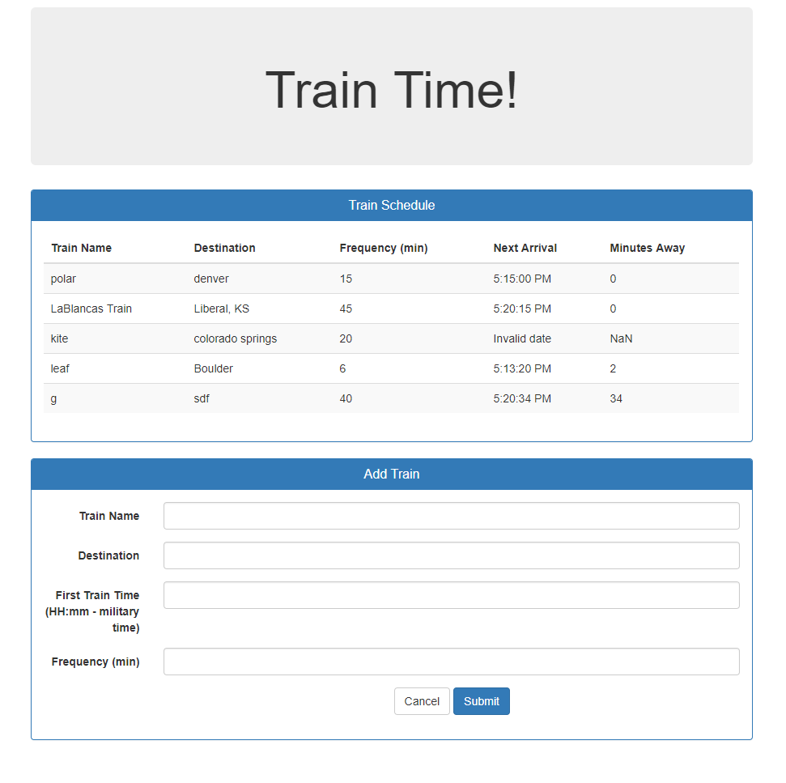

# Train Time!

This is a train schedule application that incorporates Firebase to host arrival and departure data. The app will retrieve and manipulate this information with Moment.js.Up-to-date information will be provided about various trains, namely their arrival times and how many minutes remain until they arrive at their station.

### When adding trains, you should be able to submit the following:
    

* Train Name

* Destination 

* First Train Time -- in military time

* Frequency -- in minutes.

### This app will calculate when the next train will arrive; this should be relative to the current time. 

## GitHub Repo: https://lablancaponder.github.io/TRAIN-TIME/

## Screenshot

## Languages/Libraries used:

* Javascript
* JQUERY
* Firebase
* Moment.js

